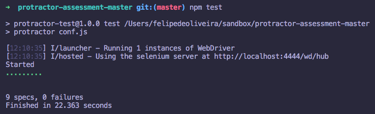

# protractor-demo

Demo of protractor tests for a simple angular application

## Setup

1. `git clone https://github.com/felipeauol/protractor-demo.git && cd protractor-demo`
2. `npm install` to install node modules
3. `npm install protractor -g` to install protractor globally
4. `webdriver-manager update` to update and install the web driver
5. `webdriver-manager start` to start the selenium web driver

## Running the tests

`npm run test`

